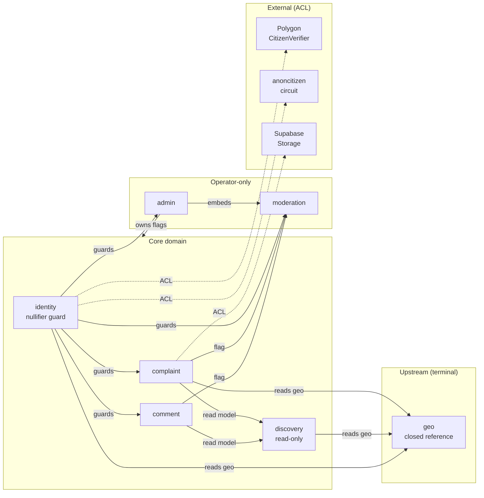

# Factivist S1 — Bounded Contexts

> **Phase 4 deliverable** (action plan §4.4 — `docs/architecture/bounded-contexts.md`).
> Per-context purpose, ubiquitous language, public interface, and anti-corruption
> boundaries for the **seven** S1 bounded contexts named in the
> [C4 container view](./s1-c4.md#level-2--container).
>
> Companion files:
>
> - [`s1-c4.md`](./s1-c4.md) — Context / Container / Component diagrams.
> - [`package-map.md`](./package-map.md) — Context ↔ `apps/*` ↔ `packages/*` mapping.
> - [`aggregates.md`](./aggregates.md) — DDD aggregates (owned by `ddd-expert`).
> - [`threat-model.md`](./threat-model.md), [`zkp-key-custody.md`](./zkp-key-custody.md)
>   — security (owned by `sec-architect`).
>
> Source of truth: action plan §4.4, [`docs/product/cost-scenarios.md`](../product/cost-scenarios.md) §S1,
> [`docs/design/s1/surfaces/*.md`](../design/s1/surfaces).

---

## Context index

| # | Context | Purpose (1 line) | Owns aggregates | Inbound | Outbound |
|---|---------|------------------|-----------------|---------|----------|
| 1 | **identity** | Issue + verify the anonymous citizen credential and gate every write. | Citizen | complaint, comment, moderation, admin | Polygon (`CitizenVerifier`), The Graph, anoncitizen circuit |
| 2 | **complaint** | Compose, store, retrieve complaints + their photos. | Complaint, Photo | discovery, comment, moderation | identity (nullifier guard), geo (FK), Supabase Storage |
| 3 | **moderation** | Manual flag queue + decisions + audit log. | ModerationCase, Flag | complaint, comment, admin | identity (nullifier guard on flag), audit log |
| 4 | **discovery** | Browse / filter / FTS over public complaints. | *(none — read-side only)* | web + mobile UI | complaint (read), geo (read) |
| 5 | **geo** | Closed reference dataset: state → district → PC → AC + PIN lookup. | Constituency *(read-only)* | complaint, discovery, identity | *(none — terminal upstream)* |
| 6 | **comment** | Threaded comments on complaints. | Comment | discovery (counts), moderation (flags) | identity (nullifier guard), moderation (enqueue) |
| 7 | **admin** | Operator shell: feature flags, health, embeds moderation. | Admin, FeatureFlag | *(operators only)* | moderation, audit log |

### Context relationship diagram

Legend: **plain arrow** = synchronous in-process call inside `apps/api`;
**`-. ACL .->`** = anti-corruption boundary against an external system.

---

## 1. identity

### Purpose

Issues and verifies the **anonymous citizen credential** that gates every
write in the system. A citizen proves uniqueness once via the
[anoncitizen circuit](../research/anoncitizen-zkp.md), and the resulting
nullifier becomes the only identifier the rest of Factivist will ever see.
Identity is the single point at which "is this caller a real, unique Indian
citizen?" is answered — no other context re-implements this check.

### Ubiquitous language

- **Citizen** — a verified principal, identified only by `nullifier`. There is
  no name, Aadhaar number, email, or phone in this context.
- **Nullifier** — Poseidon hash of `(seed, photo_chunks)` per the anoncitizen
  circuit. Uniqueness primitive; reused across sessions but never reversible.
  See [[ADR-011]] + S1 ZKP research memo.
- **Proof envelope** — `{proof, publicSignals}` produced by snarkjs /
  rapidsnark and consumed by `CitizenVerifier.sol`.
- **Session nonce** — single-use server challenge bound to the device
  session; prevents proof replay.
- **Verification status** — `unverified | verified`. There is no "pending"
  state in S1 — verify is synchronous because the chain call is.
- **Opaque handle** — UI-friendly base32 derivative of nullifier; never used
  as a key, never linkable back to PII.

### Public interface

HTTP routes exposed by `apps/api/src/routes/identity`:

- `POST /identity/nonce` → `{ nonce, expiresAt }`
- `POST /identity/verify` → `{ verified: true, handle }` (called once per
  device + circuit version)
- `GET  /identity/me` → `{ handle, verified, geo: { state, district } | null }`

Hono middleware exported to every other write route in `apps/api`:

- `nullifierGuard()` — extracts session, looks up nullifier, returns `401` if
  unverified. Mounted on **all** mutating routes (`complaint`, `comment`,
  `moderation` flag-enqueue, never `discovery` or `geo`).

No domain events are published in S1 — there is no event bus (ADR-006).
Cross-context "notifications" are in-process function calls.

### Owned aggregates

- **Citizen** — see [`aggregates.md` §Citizen](./aggregates.md#citizen).
  Tuple `(nullifier, state_code, district_code, created_at)`. No PII.

### Inbound dependencies

- `complaint`, `comment`, `moderation`, `admin` — all call `nullifierGuard()`
  middleware on write paths.
- `apps/web` + `apps/mobile` — call the three HTTP routes directly.

### Outbound dependencies

- **Polygon PoS / `CitizenVerifier.sol`** — `verifyProof()` JSON-RPC. ACL
  lives in `apps/api/src/routes/identity/verifier.ts`; the rest of the
  codebase never imports `viem` or chain types directly.
- **The Graph subgraph** — optional; subscribed to `NullifierAdded` to
  hydrate the verification UI faster than RPC polling.
- **anoncitizen circuit** — client-side WASM/native; identity owns the
  contract but the proof is built off-server (see [[ADR-011]] hybrid
  proving: rapidsnark iOS, snarkjs Android, server fallback for low-tier
  devices per [[ADR-018]]).
- **geo** — reads state/district codes to stamp on the citizen row.

### Owning packages + apps

See [`package-map.md` §identity](./package-map.md#identity).
Primary: `apps/api/src/routes/identity`,
`packages/shared/validators/identity`, `packages/db.citizens`,
`packages/contracts` (deployment glue),
`packages/ui/{web,native}/identity` (onboarding compounds).

### Key invariants

- I-1: A row in `citizens` MUST NOT contain `name`, `aadhaar`, `email`,
  `phone`, citizen photo, or device id. **ATID-IDENT-PII-001**, [[ADR-010]].
- I-2: `nullifier` MUST come from `CitizenVerifier.sol`'s emitted event /
  RPC read — never from a client claim. **ATID-IDENT-NULL-002**.
- I-3: One nullifier ↔ at most one `citizens` row (PK constraint). Replay
  inserts MUST be idempotent. **ATID-IDENT-NULL-003**.
- I-4: A session nonce is consumable exactly once and expires within 5 min.
  **ATID-IDENT-NONCE-004**.
- I-5: Server-side proof fallback (low-tier devices) MUST receive only the
  proof inputs the client would have received — never raw Aadhaar bytes.
  [[ADR-011]] + [[ADR-018]].

### What's explicitly out of scope in S1

- **Account recovery** — there is no "I lost my session" flow; a citizen
  re-runs the onboarding proof.
- **Multi-device linkage** — each device proves independently; same
  nullifier returns idempotently.
- **Role / permissions for citizens** — every verified citizen has identical
  rights. Admin authority is a separate trust root (Supabase Auth + JWT).
- **De-anonymisation hooks for law enforcement** — [[ADR-010]] makes this
  technically impossible in S1, intentionally.

---

## 2. complaint

### Purpose

Owns the lifecycle of a **complaint**: composition, persistence, photo
attachment, retrieval, and status transitions. The composer UI, the
server-side EXIF strip, and the FTS-indexed body all live here. Complaint is
the system's primary write workload.

### Ubiquitous language

- **Complaint** — author-authored text + ≤ 3 photos + category +
  constituency, written once by a verified citizen.
- **Photo** — bytes in the private `complaint-photos` Supabase bucket. Stored
  with EXIF + GPS + thumbnail tags stripped by the server pipeline.
- **Category** — slug from the 35-category taxonomy (post-merge per
  [[ADR-007]]; the "24/36 merge" listed in the constituency research memo).
  Cardinality is closed at deploy time.
- **Constituency** — `(state, district, PC|AC)` triple chosen by the author.
  Manual picker only in S1 — no auto-geolocation ([[ADR-013]]).
- **Status** — `draft | published | hidden`. `draft` is client-only;
  `hidden` is set by `moderation` (never by `complaint` itself).
- **Photo state** — `pending → ready` flip happens when the EXIF webhook
  finishes, not when the client uploads.

### Public interface

HTTP routes on `apps/api/src/routes/complaint`:

- `POST /complaints` (nullifier-guarded) → `{ id }`
- `GET  /complaints/:id` (public, behind `S1_PUBLIC_BROWSE`) → `Complaint`
- `POST /complaints/:id/photos/grant` (nullifier-guarded) → signed URL
- `POST /complaints/photos/processed` (Supabase Storage webhook only)

Domain calls exported for in-process use by `discovery`:

- `complaintRepo.list({ filter, cursor })` — read model.
- `complaintRepo.byId(id)` — single row.

### Owned aggregates

- **Complaint** — see [`aggregates.md` §Complaint](./aggregates.md#complaint).
- **Photo** — see [`aggregates.md` §Photo](./aggregates.md#photo). Photos
  are a child entity of Complaint; their lifetime is bound to it.

### Inbound dependencies

- `apps/web` + `apps/mobile` composer & detail surfaces.
- `discovery` — reads the complaint table (browse, search, facets).
- `comment` — FK target.
- `moderation` — flags / hides.

### Outbound dependencies

- `identity` — `nullifierGuard()` on all writes.
- `geo` — FK on `constituency_code` + `category_slug` (latter via `shared`).
- **Supabase Storage** — ACL in `apps/api/src/routes/complaint/storage.ts`
  (signed-URL grant + webhook). Sharp EXIF pipeline is internal.

### Owning packages + apps

See [`package-map.md` §complaint](./package-map.md#complaint).
Primary: `apps/api/src/routes/complaint`,
`packages/shared/validators/complaint`,
`packages/db.{complaints,photos}`,
`packages/ui/{web,native}/complaint`,
`apps/web/src/features/complaint`, `apps/mobile/src/features/complaint`.

### Key invariants

- C-1: Every `complaints` row carries `author_nullifier_fk` — never an email
  or handle string. **ATID-COMP-AUTH-001**, [[ADR-010]].
- C-2: A complaint MUST reference exactly one `constituency_code` from the
  closed `geo` dataset. **ATID-COMP-GEO-002**, [[ADR-007]].
- C-3: At most 3 photos per complaint, each ≤ 10 MB, validated server-side
  by Zod before signed URL is issued. **ATID-COMP-PHOTO-003**.
- C-4: A photo row only flips to `ready` after the server-side EXIF pipeline
  succeeds. Clients MUST NOT trust `pending` photos for display.
  **ATID-COMP-EXIF-004**, [[ADR-004]].
- C-5: `status` transitions are append-only audit-logged; `published →
  hidden` is owned by `moderation` (FK constraint on `decided_by`).
  **ATID-COMP-STATUS-005**.

### What's explicitly out of scope in S1

- **The ZKP proof itself** — that's `identity`. `complaint` never imports
  snarkjs/rapidsnark and never sees a proof envelope.
- **Edit / delete by author** — S1 is append-only for citizens. Removal is
  a `moderation` decision.
- **IPFS / Arweave pinning of photos** — S2 only ([[ADR-004]]).
- **Auto-categorisation / LLM classification** — manual category picker
  only in S1.
- **Auto-geolocation of constituency** — manual picker, [[ADR-013]].

---

## 3. moderation

### Purpose

The single authority for **hiding or restoring** any user-generated content
(complaints + comments). Operates a manual queue (no Bull/Redis,
[[ADR-006]]); admins act on flags raised by citizens. Every decision writes
an immutable audit row.

### Ubiquitous language

- **Flag** — `(target_kind, target_id, reason, reporter_nullifier)` raised
  by any verified citizen.
- **Reason** — enum: `spam | abuse | off-topic | pii-leak | other`.
  `pii-leak` is a distinct first-class reason per Phase 3 D4 (see
  [[ADR-021]]).
- **ModerationCase** — the queue row that aggregates one or more flags
  against the same target.
- **Decision** — `keep | remove | shadow`. `shadow` hides from public reads
  but leaves the row visible to the author + admins.
- **Audit row** — append-only `audit_log` entry written by middleware on
  every admin action, including target hash + decision metadata.

### Public interface

HTTP routes on `apps/api/src/routes/moderation`:

- `POST /moderation/flags` (internal — called by `complaint` and `comment`
  flag handlers; still nullifier-guarded)
- `GET  /moderation/queue` (admin-only) — cursor-paged
- `POST /moderation/queue/:id/decide` (admin-only) — wrapped by `auditMw`

Domain calls exported for in-process use:

- `moderation.enqueueFlag(input)` — typed wrapper around `POST /flags` for
  same-process callers in `complaint` / `comment`.

### Owned aggregates

- **ModerationCase** — see
  [`aggregates.md` §ModerationCase](./aggregates.md#moderationcase).
- **Flag** — child of ModerationCase. See
  [`aggregates.md` §Flag](./aggregates.md#flag).

### Inbound dependencies

- `complaint` — FlagAction on a complaint enqueues here.
- `comment` — FlagAction on a comment enqueues here.
- `admin` — embeds the queue surface; calls list + decide routes.

### Outbound dependencies

- `identity` — `nullifierGuard()` on flag enqueue.
- **audit log** — append-only `audit_log` table (shared with `admin`).
- `complaint` / `comment` — flips `status = hidden` via repo write owned by
  the source aggregate (moderation does not directly UPDATE another
  context's table; it calls a repo method).

### Owning packages + apps

See [`package-map.md` §moderation](./package-map.md#moderation).
Primary: `apps/api/src/routes/moderation`,
`packages/shared/validators/moderation`,
`packages/db.{moderation_queue,audit_log}`,
`packages/ui/web/moderation`, `apps/web/src/features/admin`.
**No mobile UI** — admin is web-only in S1.

### Key invariants

- M-1: A decision MUST write exactly one `audit_log` row in the same DB
  transaction as the queue UPDATE. **ATID-MOD-AUDIT-001**.
- M-2: `audit_log` is append-only; no `UPDATE` or `DELETE` SQL is allowed
  (enforced by Postgres role grants + Drizzle migration). **ATID-MOD-AUDIT-002**.
- M-3: A `decide` route MUST receive a verified admin JWT — citizen
  nullifiers cannot moderate. **ATID-MOD-AUTHZ-003**, [[ADR-014]].
- M-4: `reason = pii-leak` MUST be prioritised in queue ordering and
  surfaces a distinct ReasonBadge variant. **ATID-MOD-PII-004**, [[ADR-021]].
- M-5: Admins MUST NOT see the reporter's nullifier in the queue UI —
  reporter is stored for audit/abuse-prevention but not returned to the
  decision surface. **ATID-MOD-REPORTER-005**.

### What's explicitly out of scope in S1

- **LLM-assisted triage** — S2 only.
- **Appeals workflow** — author cannot appeal a `remove` in S1; the IT Act
  grievance officer route ([[ADR-014]]) is the escape valve.
- **Automated takedowns** — every decision is a human click in S1.
- **Cross-target case merging** — each target gets its own case; duplicate
  flags accumulate as child rows but cases are not merged in S1.

---

## 4. discovery

### Purpose

The **read model** for public browsing. Owns the browse, filter, search,
and facet routes that power Surfaces 04 + 05. No write paths. No
aggregates. Uses Postgres FTS + GIN (no Meilisearch in S1, [[ADR-005]]).

### Ubiquitous language

- **Browse query** — `{ state?, district?, constituency?, category?, cursor }`.
- **Search query** — `{ q, filter?, cursor }`. `q` is plainto_tsquery against
  `complaints.body` + `complaints.title`.
- **Facet** — counts per category + constituency for the *current* filter.
- **Cursor** — opaque keyset cursor (id + created_at), never offset-based.
- **Tsvector** — Postgres-managed generated column on `complaints`; owned
  physically by `complaint` context but read-only from here.

### Public interface

HTTP routes on `apps/api/src/routes/discovery`:

- `GET /discovery/browse` — cursor-paged complaint list.
- `GET /discovery/search` — same shape + `q`.
- `GET /discovery/facets` — counts for the active filter.

No middleware, no auth — all routes are public behind the
`S1_PUBLIC_BROWSE` feature flag (read from `feature_flags` via
`apps/api/src/lib/flags.ts`).

### Owned aggregates

**None.** Discovery is a CQRS read side; it owns query shapes, not data.

### Inbound dependencies

- `apps/web` + `apps/mobile` browse + search surfaces.

### Outbound dependencies

- `complaint` — reads `complaints` + `photos` (read-only). Discovery never
  mutates.
- `geo` — joins for human-readable constituency names + cascade filters.
- `feature_flags` — gates the whole surface.

### Owning packages + apps

See [`package-map.md` §discovery](./package-map.md#discovery).
Primary: `apps/api/src/routes/discovery`,
`packages/shared/validators/discovery`,
`packages/ui/{web,native}/discovery`,
`apps/web/src/features/discovery`,
`apps/mobile/src/features/discovery`.

### Key invariants

- D-1: Discovery MUST NOT issue any `INSERT`, `UPDATE`, or `DELETE`. SQL is
  whitelisted to `SELECT` by Postgres role grants. **ATID-DISC-READONLY-001**.
- D-2: Pagination MUST be keyset (cursor on `(created_at, id)`) — never
  `OFFSET`. **ATID-DISC-CURSOR-002**.
- D-3: Search MUST use `plainto_tsquery` (sanitised) — never string
  interpolation into `to_tsquery`. **ATID-DISC-FTS-003**, [[ADR-005]].
- D-4: When `S1_PUBLIC_BROWSE = false`, all four routes return `503` with a
  generic message. **ATID-DISC-FLAG-004**.

### What's explicitly out of scope in S1

- **Personalised ranking** — purely chronological + filter-driven.
- **Saved searches / alerts** — S2.
- **Geo-radius queries** — S1 ships state/district/constituency cascade
  only, no lat/lng or radius search ([[ADR-013]]).
- **External index (Meilisearch / OpenSearch)** — S3 only ([[ADR-005]]).
- **Aggregations across constituencies (heatmaps, trends)** — S2.

---

## 5. geo

### Purpose

The **closed reference dataset** that all other contexts use to talk about
Indian administrative geography: states + UTs → districts → parliamentary
constituencies + assembly constituencies, plus a PIN → constituency
best-effort lookup. Loaded once via a Drizzle seed migration; read-only at
runtime ([[ADR-007]]).

### Ubiquitous language

- **State** — one of 28 states + 8 UTs. PK is the ECI state code.
- **District** — administrative unit under a state.
- **Constituency** — either a Parliamentary Constituency (PC) or Assembly
  Constituency (AC); `level` discriminates.
- **PIN** — India Post PIN code. Maps many-to-many to constituencies (a
  single PIN often spans multiple ACs).
- **Slug PK** — every row uses a stable, human-readable slug as primary key
  per [[ADR-012]] (e.g. `state_code = "MH"`, not `state_id = 17`).

### Public interface

HTTP routes on `apps/api/src/routes/geo` — all `GET`, all public, no flag
gate (geo metadata is harmless to expose):

- `GET /geo/states`
- `GET /geo/states/:code/districts`
- `GET /geo/districts/:code/constituencies`
- `GET /geo/pin/:pin` → multiple matches; UI disambiguates.

Compile-time exports from `packages/shared/constants/geo`:

- `STATE_CODES`, `DISTRICT_CODES`, `CONSTITUENCY_LEVELS` — Zod enums
  generated from the seed file so callers get type-narrowed params.

### Owned aggregates

- **Constituency** *(read-only)* — see
  [`aggregates.md` §Constituency](./aggregates.md#constituency). Includes
  the State + District parent rows it depends on.

### Inbound dependencies

- `complaint` — FK on `constituency_code`.
- `discovery` — joins for filter + facet names.
- `identity` — stamps `(state_code, district_code)` on the citizen row.
- `apps/web` + `apps/mobile` constituency pickers.

### Outbound dependencies

**None.** Geo is the terminal upstream context. The only thing it touches
is the Drizzle migration seed at build time.

### Owning packages + apps

See [`package-map.md` §geo](./package-map.md#geo).
Primary: `apps/api/src/routes/geo`,
`packages/shared/constants/geo`,
`packages/db.{states,districts,constituencies,pin_constituency}`,
`packages/db/seed/geo.ts`.

### Key invariants

- G-1: Geo tables are read-only at runtime — Postgres role grants forbid
  `INSERT/UPDATE/DELETE` from the app role. Mutations happen only via
  versioned migrations. **ATID-GEO-RO-001**, [[ADR-007]].
- G-2: Seed MUST be idempotent — re-running the migration produces no diff
  on identical input. **ATID-GEO-SEED-002**.
- G-3: PIN → constituency is **best-effort, multi-result**; the API never
  asserts a single answer ([[ADR-013]]). UI MUST present a picker on
  ambiguity. **ATID-GEO-PIN-003**.
- G-4: PKs are slugs ([[ADR-012]]) — never bigserial — so codes survive
  re-seed without churn. **ATID-GEO-SLUG-004**.

### What's explicitly out of scope in S1

- **User-editable boundaries** — boundaries change only with a migration +
  release.
- **GeoJSON shapes / map rendering** — S1 ships codes + names; map polygons
  are S2.
- **GPS reverse-geocoding** — [[ADR-013]] explicitly defers to manual
  picker; lat/lng is never sent to the server in S1.
- **Foreign geography** — India only.

---

## 6. comment

### Purpose

Threaded discussion attached to a complaint. Same nullifier guard as
complaints; same flag-to-moderation flow. UI compounds are shared by web +
mobile but rendered with their respective HeroUI variant.

### Ubiquitous language

- **Comment** — `{ id, complaint_id, parent_id?, author_nullifier, body,
  status, created_at }`.
- **Thread** — a tree of comments under one complaint, materialised by
  recursive CTE at query time.
- **Reply** — a comment with non-null `parent_id`.
- **Status** — `published | hidden`. Same semantics as Complaint.status.

### Public interface

HTTP routes on `apps/api/src/routes/comment`:

- `POST /complaints/:id/comments` (nullifier-guarded)
- `GET  /complaints/:id/comments` — threaded, cursor-paged
- `POST /comments/:id/flag` (nullifier-guarded) — calls `moderation.enqueueFlag()`

### Owned aggregates

- **Comment** — see [`aggregates.md` §Comment](./aggregates.md#comment).

### Inbound dependencies

- `apps/web` + `apps/mobile` complaint detail surfaces.
- `discovery` — comment counts surface in facets (read-only).
- `moderation` — flips `status` via repo method.

### Outbound dependencies

- `identity` — `nullifierGuard()` on write paths.
- `complaint` — FK on `complaint_id`; read for parent existence check.
- `moderation` — in-process call to `enqueueFlag()`.

### Owning packages + apps

See [`package-map.md` §comment](./package-map.md#comment).
Primary: `apps/api/src/routes/comment`,
`packages/shared/validators/comment`,
`packages/db.comments`,
`packages/ui/{web,native}/comment`.

### Key invariants

- CM-1: A comment MUST belong to a published, non-hidden complaint. Replies
  to a hidden parent return `404`. **ATID-CM-VISIBILITY-001**.
- CM-2: `parent_id` MUST reference a comment under the same `complaint_id`
  (FK + check constraint). **ATID-CM-PARENT-002**.
- CM-3: Depth is unbounded in the schema but the API caps render depth at
  **3 levels** in S1 (deeper replies still write; renderer collapses).
  **ATID-CM-DEPTH-003**.
- CM-4: Like complaints, comment rows carry `author_nullifier_fk` only —
  no display name. **ATID-CM-AUTH-004**, [[ADR-010]].

### What's explicitly out of scope in S1

- **Edit / delete by author** — append-only; removal is a moderation
  decision.
- **Reactions / upvotes** — S2.
- **@mentions / notifications** — S2 (no notification system in S1).
- **Rich text** — plain text + line breaks only.

---

## 7. admin

### Purpose

The operator shell. Hosts feature-flag toggles, health probes, and embeds
the moderation queue. **Web-only in S1** — there is no admin mobile build.
Admins authenticate via Supabase Auth (JWT + `role=admin` claim) — a
separate trust root from citizens.

### Ubiquitous language

- **Admin** — a Supabase Auth user with the `role=admin` claim. Not a
  Citizen — no nullifier.
- **FeatureFlag** — `{ key, enabled, updated_by, updated_at }`. Two flags
  exist in S1: `S1_PUBLIC_BROWSE`, `S1_COMPLAINT_SUBMIT`.
- **Grievance Officer** — the named human required by [[ADR-014]] (IT Act
  intermediary obligation). Tracked in the admin context as a configuration
  record, not as an Admin row.
- **Audit log** — the same `audit_log` table moderation uses; admin writes
  entries for every flag flip + grievance acknowledgement.

### Public interface

HTTP routes on `apps/api/src/routes/admin`:

- `GET  /admin/flags` (admin-JWT)
- `POST /admin/flags/:key` (admin-JWT) — body `{ enabled, reason }`
- `GET  /admin/health` (admin-JWT) — DB + Polygon RPC + Storage ping

### Owned aggregates

- **Admin** — see [`aggregates.md` §Admin](./aggregates.md#admin).
- **FeatureFlag** — see
  [`aggregates.md` §FeatureFlag](./aggregates.md#featureflag).

### Inbound dependencies

- Browser sessions in `apps/web/src/features/admin` only.

### Outbound dependencies

- **Supabase Auth** — JWT verification middleware
  (`apps/api/src/lib/admin-auth.ts`).
- **moderation** — embedded via `apps/web` route group; HTTP-wise admin
  doesn't proxy moderation, it just renders alongside.
- **audit log** — append-only writes on every flag flip.

### Owning packages + apps

See [`package-map.md` §admin](./package-map.md#admin).
Primary: `apps/api/src/routes/admin`,
`packages/shared/validators/admin`,
`packages/db.{feature_flags,audit_log}`,
`packages/ui/web/admin`, `apps/web/src/features/admin`.

### Key invariants

- A-1: Admin routes MUST verify a Supabase JWT with `role=admin`. Any other
  claim → `403`. **ATID-ADMIN-JWT-001**, [[ADR-014]].
- A-2: Admin context MUST NOT read from `citizens` — there is no operator
  view of the citizen table. **ATID-ADMIN-ISOLATION-002**, [[ADR-010]].
- A-3: Every flag flip writes an `audit_log` row in the same transaction
  with `reason` populated. **ATID-ADMIN-AUDIT-003**.
- A-4: `S1_PUBLIC_BROWSE = false` AND `S1_COMPLAINT_SUBMIT = false`
  simultaneously is a valid "lights out" state and MUST be reachable in one
  click from the flags surface (incident-response per Phase 2 runbook).
  **ATID-ADMIN-KILL-004**.

### What's explicitly out of scope in S1

- **Mobile admin** — explicitly no Expo build for admins ([[ADR-008]] +
  Phase 3 D3).
- **User management** — there is no admin UI to ban a citizen; the only
  available lever is `moderation` decisions on individual content.
- **Analytics dashboards** — health is the only operator view in S1.
- **Configuration of the ZKP circuit / contract address** — environment
  variables only, not admin-editable.

---

## Cross-context invariants

These hold across all seven contexts. Anyone proposing a change MUST cite
which invariant they are modifying.

| # | Invariant | Source |
|---|-----------|--------|
| **X-1** | Every write request hits `identity.nullifierGuard()` before any aggregate is touched. | s1-c4.md C-2 |
| **X-2** | No context persists citizen PII (name, Aadhaar, email, phone, citizen photo, device id). | [[ADR-010]] |
| **X-3** | `geo` is read-only at runtime. No user-editable shapes, no live boundary edits. | [[ADR-007]], [[ADR-013]] |
| **X-4** | `moderation` is the only context that may flip `status = hidden` on Complaint or Comment. Other contexts call its repo, not the table. | M-1 |
| **X-5** | `admin` MUST NOT read the `citizens` table; the operator view is intentionally citizen-blind. | A-2, [[ADR-010]] |
| **X-6** | All cross-context calls in S1 are **in-process function calls inside `apps/api`** — there is no event bus, no queue, no inter-service HTTP. | [[ADR-006]] |
| **X-7** | All inter-process contracts (HTTP request/response, FK shapes) are Zod schemas in `packages/shared/validators/<ctx>`. No duplicate schema definitions. | [[ADR-002]] |
| **X-8** | All DB access is via Drizzle on `apps/api`. `apps/web` + `apps/mobile` NEVER import `packages/db`. | [[ADR-001]] |
| **X-9** | `S1_PUBLIC_BROWSE` + `S1_COMPLAINT_SUBMIT` flags are read on every request — not cached longer than 30 s. | s1-c4.md C-5 |

---

## Context churn risk — what splits in S2

| Context | Likely S2 evolution | Trigger |
|---------|---------------------|---------|
| **moderation** | Splits into `moderation` (manual) + `moderation-auto` (LLM-assisted triage). Manual queue stays for appeals + ambiguous cases. | LLM moderation feature gate; cost-scenarios §S2. |
| **complaint** | Spawns `archival` sub-context for IPFS/Arweave pinning; `complaint` keeps the live row, `archival` owns immutability. | [[ADR-004]] S2 follow-up. |
| **identity** | Adds `attestation` sub-context for the `ComplaintRegistry.sol` on-chain attestation flow. Nullifier core stays in `identity`. | [[ADR-003]] S2. |
| **discovery** | Likely splits read into `discovery` (browse) + `search` (Meilisearch-backed). FTS in S1 is the seam. | [[ADR-005]] S3 trigger — may slip earlier if S2 traffic justifies. |
| **geo** | Gains a read-only `geo-shapes` adjunct for map polygons. Core slug PKs unchanged. | Map UI work in S2. |
| **comment** | Gains reactions + notifications — likely a new `engagement` context rather than bloating `comment`. | S2 product backlog. |
| **admin** | Splits into `admin-ops` (flags, health) + `admin-trust` (grievance, takedowns, user reports). [[ADR-014]] grievance surface grows in S2 with SSMI-tier obligations. | Crossing the 5M-user SSMI threshold. |

> Treat this table as advisory, not committed. Any S2 split is a fresh
> ADR + a new bounded-contexts row, not a refactor under the same name.
