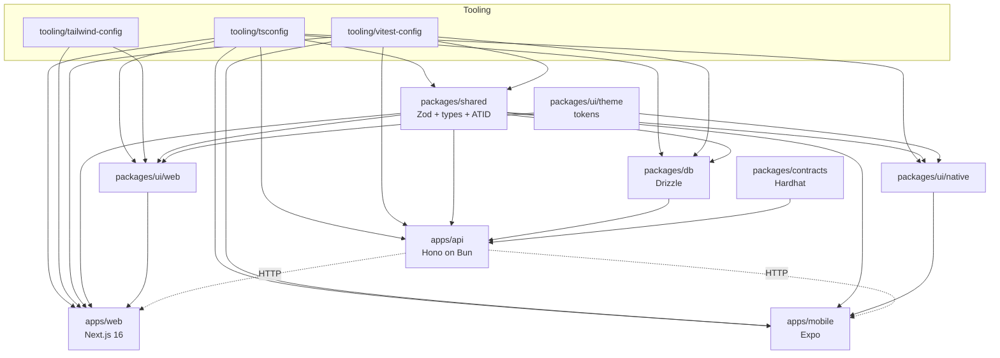

# Factivist S1 — Package Map

> **Phase 4 deliverable** (action plan §4.5 — `docs/architecture/package-map.md`).
> Maps the seven [bounded contexts](./bounded-contexts.md) to the physical
> `apps/*` + `packages/*` + `tooling/*` layout of this monorepo. Pairs with
> the [C4 container view](./s1-c4.md#level-2--container) and the project
> dependency graph in [`CLAUDE.md`](../../CLAUDE.md#dependency-graph).
>
> Companion files:
>
> - [`bounded-contexts.md`](./bounded-contexts.md) — per-context spec.
> - [`s1-c4.md`](./s1-c4.md) — Context / Container / Component diagrams.
> - [`aggregates.md`](./aggregates.md) — DDD aggregates (owned by `ddd-expert`).
>
> Source of truth for the physical layout:
> [`CLAUDE.md` §Monorepo Structure](../../CLAUDE.md) +
> [`CLAUDE.md` §Architecture Rules](../../CLAUDE.md).

---

## Repo physical layout

```
apps/
  web/              → Next.js 16 + HeroUI v3 + Tailwind CSS v4.3
  api/              → Hono on Bun runtime (Fly.io BOM primary, SIN failover)
  mobile/           → Expo SDK + Expo Router + HeroUI Native + Uniwind
packages/
  ui/theme/         → Primitive + semantic design tokens (oklch)
  ui/web/           → HeroUI v3 component wrappers (compound API)
  ui/native/        → HeroUI Native component wrappers (compound API)
  shared/           → Zod schemas, types, constants, ATID registry
  db/               → Drizzle ORM schema + migrations + seed (Supabase Postgres)
  contracts/        → Solidity 0.8.x + Hardhat (CitizenVerifier.sol glue)
tooling/
  tsconfig/         → base.json, react.json, node.json
  tailwind-config/  → Shared Tailwind v4.3 preset + HeroUI plugin
  vitest-config/    → base.ts, react.ts, node.ts (95/95/95/90 coverage)
```

Bun-only package manager. Turborepo for task graph. Biome for lint + format.

---

## Master mapping — context ↔ apps ↔ packages

| Context | Primary `apps/*` | Primary `packages/*` | Out of bounds (MUST NOT import) |
|---------|------------------|---------------------|---------------------------------|
| <a id="identity"></a>**identity** | `apps/api/src/routes/identity`, `apps/web/src/features/identity`, `apps/mobile/src/features/identity` | `packages/shared/validators/identity`, `packages/shared/types/identity`, `packages/db.citizens`, `packages/contracts`, `packages/ui/web/identity`, `packages/ui/native/identity` | `packages/db` from `apps/web`/`apps/mobile`; `snarkjs`/`rapidsnark` from any context other than identity |
| <a id="complaint"></a>**complaint** | `apps/api/src/routes/complaint`, `apps/web/src/features/complaint`, `apps/mobile/src/features/complaint` | `packages/shared/validators/complaint`, `packages/db.{complaints,photos}`, `packages/ui/web/complaint`, `packages/ui/native/complaint` | `packages/db` from `apps/{web,mobile}`; direct Supabase Storage SDK from anywhere but `apps/api` |
| <a id="moderation"></a>**moderation** | `apps/api/src/routes/moderation`, `apps/web/src/features/admin` | `packages/shared/validators/moderation`, `packages/db.{moderation_queue,audit_log}`, `packages/ui/web/moderation` | `apps/mobile` (no mobile admin in S1); `packages/ui/native/moderation` (does not exist) |
| <a id="discovery"></a>**discovery** | `apps/api/src/routes/discovery`, `apps/web/src/features/discovery`, `apps/mobile/src/features/discovery` | `packages/shared/validators/discovery`, `packages/ui/web/discovery`, `packages/ui/native/discovery` | `packages/db.*` write paths (read-only role grants); Meilisearch / OpenSearch SDKs ([[ADR-005]]) |
| <a id="geo"></a>**geo** | `apps/api/src/routes/geo` | `packages/shared/constants/geo`, `packages/db.{states,districts,constituencies,pin_constituency}`, `packages/db/seed/geo.ts` | Any runtime writer of geo tables; GPS / lat-lng libs ([[ADR-013]]) |
| <a id="comment"></a>**comment** | `apps/api/src/routes/comment`, `apps/web/src/features/comment`, `apps/mobile/src/features/comment` | `packages/shared/validators/comment`, `packages/db.comments`, `packages/ui/web/comment`, `packages/ui/native/comment` | Direct `packages/db.complaints` writes from comment (read-only FK only) |
| <a id="admin"></a>**admin** | `apps/api/src/routes/admin`, `apps/web/src/features/admin` | `packages/shared/validators/admin`, `packages/db.{feature_flags,audit_log}`, `packages/ui/web/admin` | `apps/mobile` (web-only by [[ADR-008]] + Phase 3 D3); `packages/db.citizens` reads ([[ADR-010]]) |

---

## Per-package responsibility

| Package | Owns | Depends on | Used by | Notes |
|---------|------|------------|---------|-------|
| `packages/shared` | Zod schemas, types, constants, ATID registry | Zod (only) | All apps + `packages/db` (types only) | **Zero runtime deps beyond Zod** ([[ADR-002]]). Validates on client AND server. |
| `packages/db` | Drizzle schema, migrations, seeds | `packages/shared` (types), `drizzle-orm`, `postgres` | `apps/api` only | NEVER imported from `apps/web` or `apps/mobile` ([[ADR-001]]). Migrations are versioned + idempotent. |
| `packages/ui/theme` | Design tokens (oklch primitives + semantic mappings) | none | `packages/ui/{web,native}`, `tooling/tailwind-config` | No runtime; tokens compile to CSS vars + JS objects. Locked per Phase 3 token freeze. |
| `packages/ui/web` | HeroUI v3 compound components (dot notation) | `packages/ui/theme`, `packages/shared` (types only), `@heroui/react`, `tailwindcss` | `apps/web` only | Semantic variants only. SSR-safe. No mobile imports. |
| `packages/ui/native` | HeroUI Native compound components | `packages/ui/theme`, `packages/shared` (types only), `heroui-native`, `uniwind` | `apps/mobile` only | Same compound API surface as `ui/web` where applicable. No web imports. |
| `packages/contracts` | `CitizenVerifier.sol` glue + Hardhat deploy/test | `hardhat`, `viem`/`ethers` | `apps/api` (identity ACL only) | Deploy via 3/5 Safe multisig; Amoy + mainnet networks pinned in `hardhat.config.ts`. |
| `apps/api` | Hono routes for all 7 contexts, the only DB writer | `packages/{shared,db,contracts}`, `hono`, `@supabase/*` (server SDK) | Clients: `apps/web`, `apps/mobile` | Single deployable. Fly.io BOM primary + SIN failover. All context boundaries are folders under `src/routes/`. |
| `apps/web` | Next.js 16 RSC + admin shell | `packages/{shared,ui/web,ui/theme}`, `next`, `@tanstack/react-query` | Browsers (citizen + admin) | Server Components by default. `"use client"` islands only when needed. NEVER imports `packages/db`. |
| `apps/mobile` | Expo Router screens (iOS + Android) | `packages/{shared,ui/native,ui/theme}`, `expo`, `expo-router`, `@tanstack/react-query` | iOS 16+ / Android 11+ | 100% shared business logic via `packages/shared` ([[ADR-008]]). NEVER imports `packages/db`. No admin surface ([[ADR-008]] + Phase 3 D3). |
| `tooling/tsconfig` | `base.json`, `react.json`, `node.json` | none | Every package + app | Enforces strict mode + path mappings that mirror dependency graph. |
| `tooling/tailwind-config` | Tailwind v4.3 preset + HeroUI plugin wiring | `packages/ui/theme` | `apps/web`, `packages/ui/web` | Single source of utility config. Native side uses Uniwind separately. |
| `tooling/vitest-config` | `base.ts`, `react.ts`, `node.ts` | `vitest`, `@vitest/coverage-*` | Every package + app | Enforces ≥95/95/95/90 coverage. CI fails below threshold. |

---

## Dependency graph

Mirrors [`CLAUDE.md` §Dependency Graph](../../CLAUDE.md). Agents MUST
respect this graph — see anti-pattern table below.



**Read rules:**

- Solid arrow = compile-time import allowed.
- `-. HTTP .->` = runtime HTTP boundary; clients never import server modules.
- Absence of an arrow = forbidden import (see next section).

---

## Anti-pattern table — forbidden imports

| Forbidden | Why it's forbidden | Enforcement |
|-----------|--------------------|-------------|
| `apps/web` → `packages/db` | Web must not own a DB connection; all data flows via `apps/api` HTTP. | tsconfig path map omits `@factivist/db` from web; Biome `noRestrictedImports`; CI grep gate. |
| `apps/mobile` → `packages/db` | Same — mobile cannot pin a Postgres driver. | Same as above. |
| `apps/web` → `apps/mobile` (and vice versa) | Apps are independent deployables. | tsconfig project refs do not list sibling apps; Biome rule. |
| `apps/api` → `apps/{web,mobile}` | Server cannot depend on a client. | tsconfig + Biome. |
| `packages/ui/web` → `packages/ui/native` (and reverse) | Different runtimes (DOM vs RN). | Separate `tsconfig.json` extends; package `"exports"` field excludes the other. |
| `packages/shared` → `packages/db` | `shared` is zero-dep beyond Zod ([[ADR-002]]). | Strict `dependencies` allowlist in `packages/shared/package.json`; CI dep audit. |
| `packages/db` → any `apps/*` | DB layer is upstream of apps. | Package boundaries + tsconfig refs. |
| `packages/contracts` → any non-Hardhat runtime | Solidity / Hardhat code stays in contracts; only ABI types are imported by `apps/api`. | `packages/contracts/dist/abi/*.d.ts` is the only public export. |
| Any context → another context's tables directly | Cross-context writes go through the owner's repo method. | Drizzle schema is partitioned per context; PRs that touch another context's tables require the owner-agent reviewer. |
| `apps/web` → `snarkjs`/`rapidsnark` outside `features/identity` | ZKP proving is identity-owned. | Biome `noRestrictedImports` scoped by directory. |
| `admin` context → `packages/db.citizens` | Operator view is intentionally citizen-blind ([[ADR-010]]). | Postgres role grants + per-route lint rule. |

> All Biome rules live in `biome.json` at repo root with per-package overrides
> in `apps/*/biome.json` and `packages/*/biome.json`.

---

## How a new bounded context onboards

A 5-step checklist for proposing an 8th context (or any S2 split).

1. **Write the ADR.** Create `docs/adr/NNNN-<context>-bounded-context.md`
   explaining purpose, owned aggregates, and which existing context (if any)
   is shrinking. Link it from `bounded-contexts.md` Context Index.
2. **Add the validator package folder.** `packages/shared/validators/<ctx>/`
   with Zod schemas; add `packages/shared/types/<ctx>/` for derived types.
   No other package may define the schema.
3. **Add the route folder.** `apps/api/src/routes/<ctx>/` with a single
   `index.ts` mounting the sub-router. Add the route's `nullifierGuard()`
   wiring if any path mutates state.
4. **Add the table partition.** `packages/db/schema/<ctx>.ts` (Drizzle).
   Generate the migration via `bun run db:generate`. Owner-agent reviewer is
   the new context's owner.
5. **Add the UI compound folder** *(if user-facing)*. `packages/ui/web/<ctx>/`
   and/or `packages/ui/native/<ctx>/`, plus `apps/{web,mobile}/src/features/<ctx>/`.
   Update [`s1-c4.md`](./s1-c4.md) L3 with a new component diagram and
   update [`bounded-contexts.md`](./bounded-contexts.md) with a full section.

Gate: PR must include updates to (a) ADR, (b) bounded-contexts.md, (c)
package-map.md, (d) s1-c4.md, plus tests at the 95/95/95/90 threshold.

---

## Cross-package import rules cheat-sheet

Mirrors [`CLAUDE.md` §Architecture Rules](../../CLAUDE.md). One line per rule.

| Rule | Allowed | Forbidden |
|------|---------|-----------|
| **Zod schemas** | Define in `packages/shared/validators/<ctx>/` once. | Redefining a request shape in `apps/web` or `apps/mobile`. |
| **DB access** | Drizzle, in `apps/api` only ([[ADR-001]]). | Raw SQL; Prisma; client-side DB calls. |
| **Server state** | TanStack Query in `apps/{web,mobile}`. | Redux; SWR; ad-hoc `fetch` in components. |
| **Client state** | Zustand in `apps/{web,mobile}`. | Context for cross-feature state; Redux. |
| **Forms** | React Hook Form + Zod resolver in apps. | Formik; uncontrolled forms; bespoke validation. |
| **UI components** | HeroUI compound (dot notation) via `packages/ui/{web,native}`. | Raw HeroUI imports in `apps/*`; non-compound consumption. |
| **Design tokens** | Semantic variants from `packages/ui/theme` (oklch). | Hard-coded hex / RGB; raw Tailwind colours. |
| **Next.js** | Server Components by default; `"use client"` only when needed. | Marking everything `"use client"`; client-only fetching for data already serverable. |
| **Supabase** | Custom-domain endpoints only ([[ADR-009]]) — India ISP mitigation. | `*.supabase.co` URLs in any code path. |
| **Storage** | Signed-URL grants from `apps/api`; EXIF stripped server-side. | Direct client uploads to a public bucket; client-side EXIF strip as the only line of defence. |
| **Chain access** | `apps/api/src/routes/identity` ACL; viem/ethers nowhere else. | `viem`/`ethers` imports in `apps/web` or `apps/mobile`. |
| **Auth** | Citizens → nullifier per session; Admins → Supabase JWT (`role=admin`). | Sharing the citizen and admin trust roots; long-lived bearer tokens for citizens. |
| **Package exports** | All packages declare `"exports"` field for multi-bundler resolution. | Default `main`/`module` only; deep imports past `"exports"`. |
| **Testing** | Vitest unit + integration; Playwright web E2E; Detox mobile E2E. | Jest; Cypress; untested merges (CI gate: 95/95/95/90). |
| **Logs / errors** | Sentry with `beforeSend` PII scrub; structured logs without PII. | `console.log(user)`; nullifier in logs is OK, name/Aadhaar is NEVER OK. |

> When in doubt, check the dependency graph above and the
> [bounded-contexts cross-context invariants](./bounded-contexts.md#cross-context-invariants).
