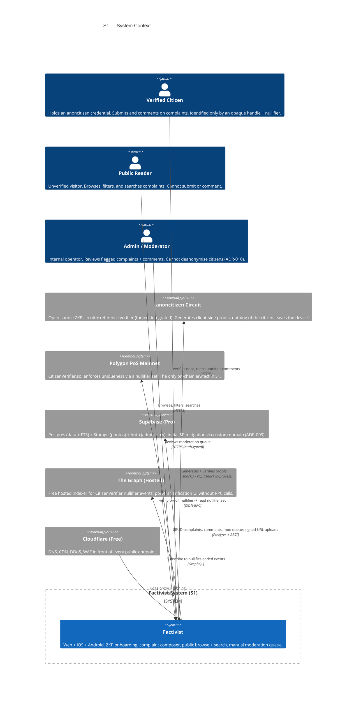
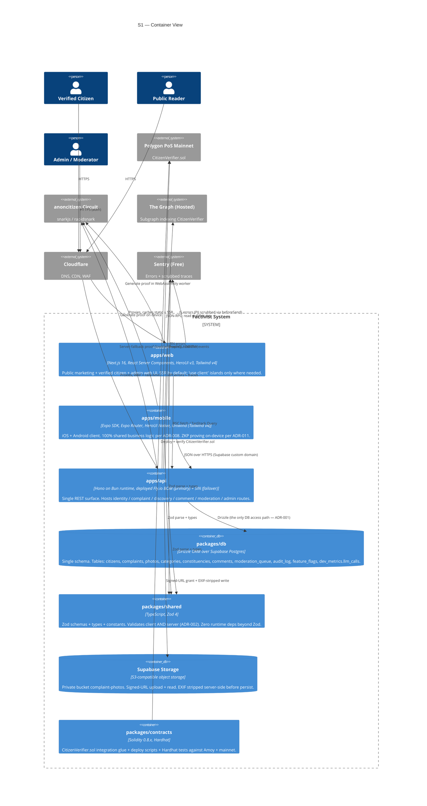
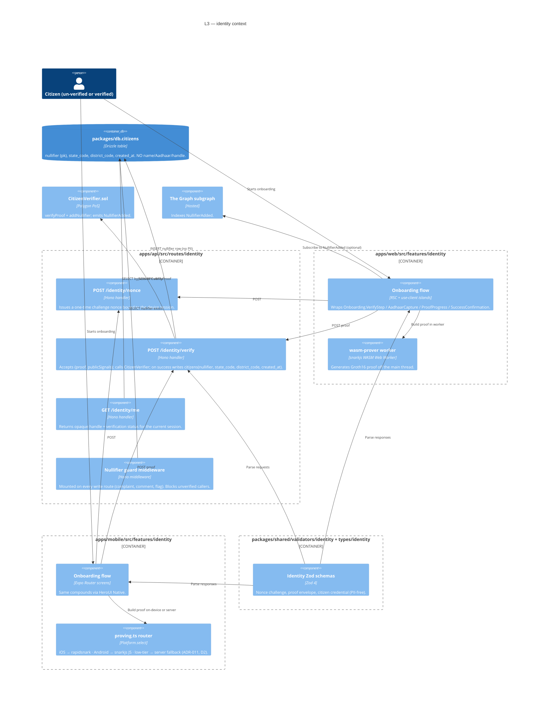
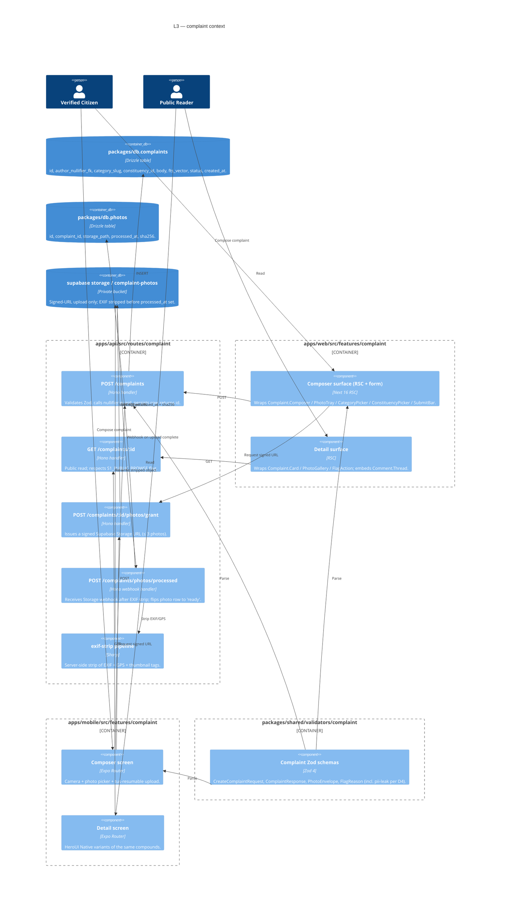
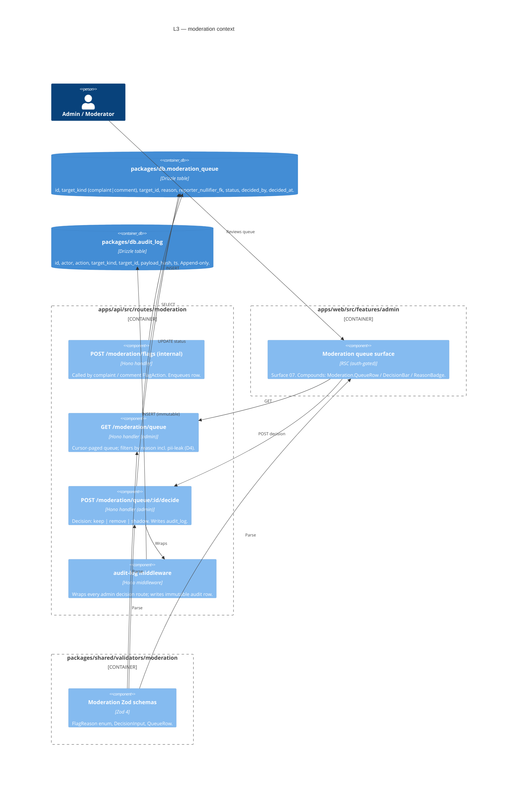
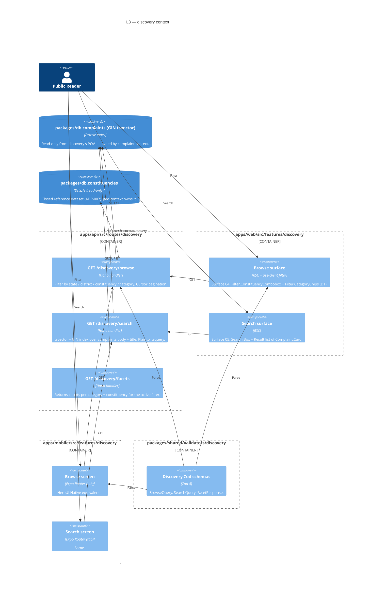
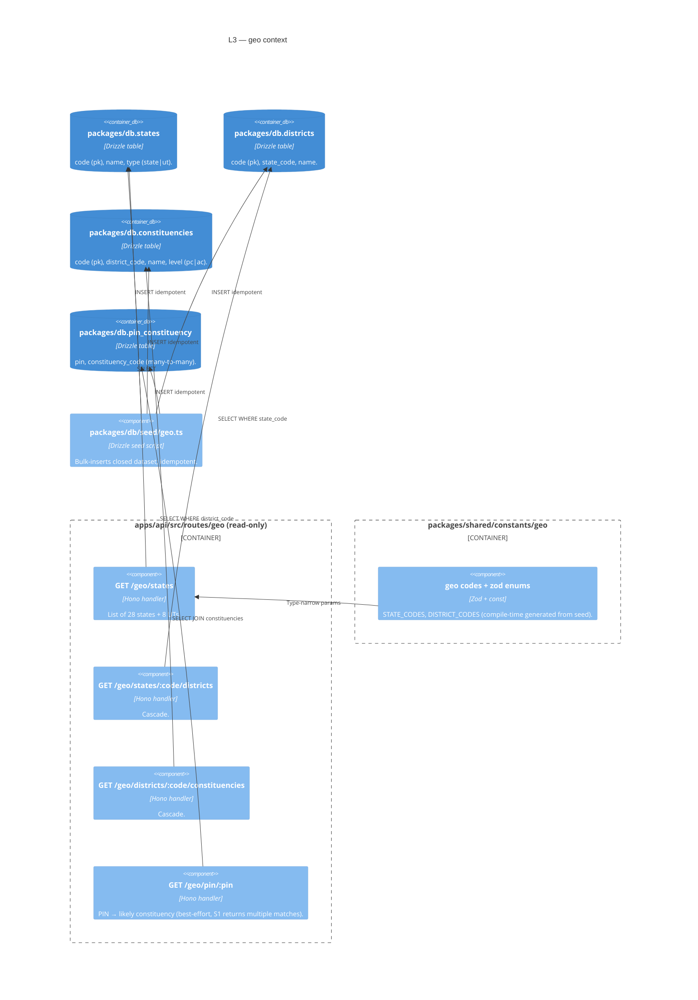
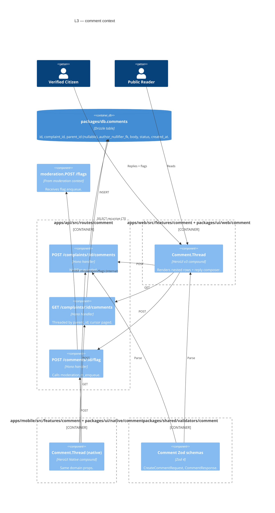
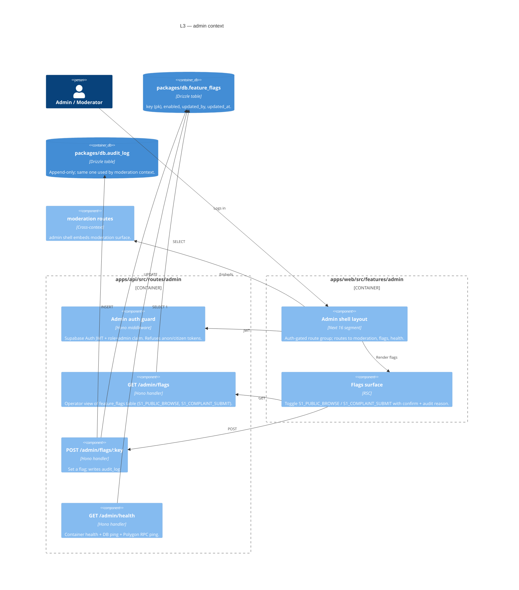

# Factivist S1 — C4 Architecture Diagrams

> **Phase 4 deliverable** (action plan §4.5 — `docs/architecture/s1-c4.md`).
> Three nested views of the S1 system using the
> [C4 model](https://c4model.com): **Context → Container → Component**.
> Diagrams are inline Mermaid so they render on GitHub, in IDEs, and in
> review comments without external assets.
>
> Companion files:
>
> - [`bounded-contexts.md`](./bounded-contexts.md) — per-context purpose,
>   public interface, anti-corruption boundary.
> - [`package-map.md`](./package-map.md) — bounded context ↔ `apps/*` ↔
>   `packages/*` mapping.
> - [`aggregates.md`](./aggregates.md) — DDD aggregates (owned by
>   `ddd-expert`).
> - [`threat-model.md`](./threat-model.md), [`zkp-key-custody.md`](./zkp-key-custody.md)
>   — security (owned by `sec-architect`).
>
> Source of truth for in-scope feature set: action plan §4.4 (bounded
> contexts), [`docs/product/cost-scenarios.md`](../product/cost-scenarios.md) §S1
> (8 features), [`docs/design/s1/surfaces/*.md`](../design/s1/surfaces) (9
> surfaces).

---

## LEVEL 1 — System Context

Factivist is a single product accessed from three clients (web, iOS, Android)
and integrated with five external systems. Every contributor inside the
"Factivist System" boundary is provably a unique Indian citizen (via a ZKP
nullifier set on Polygon PoS), but the system itself stores **no PII**.

### Context-level invariants (S1)

| # | Invariant | Enforced by |
|---|-----------|-------------|
| C-1 | No PII (name, Aadhaar, address, citizen photo) ever crosses the system boundary into Factivist storage. | ADR-010, EXIF strip server-side (ADR-004), `aidefence_has_pii` on every write path. |
| C-2 | Every write request (submit complaint, post comment, flag) is preceded by a server-side nullifier check against the Polygon `CitizenVerifier` set. | identity context (see L2). |
| C-3 | One smart contract only: `CitizenVerifier.sol`. No `ComplaintRegistry` until S2. | ADR-003. |
| C-4 | All public endpoints sit behind Supabase **custom domain** + Cloudflare proxy (India ISP block mitigation). | ADR-009. |
| C-5 | Public read access is gated by a single flag `S1_PUBLIC_BROWSE`; write access by `S1_COMPLAINT_SUBMIT` (action plan §5.4). | `feature_flags` row in Postgres. |

---

## LEVEL 2 — Container

Inside the Factivist boundary, the system is **five containers** plus the
external dependencies it integrates with. Each container has one technology
choice and one deployment target.

### Container quality attributes

| Container | Availability target | Scale (S1) | Hard constraint |
|-----------|--------------------|------------|-----------------|
| `apps/web` | 99.5% | ≤ 1k MAU | Vercel Pro region `bom1` primary |
| `apps/mobile` | n/a (client) | iOS 16+ / Android 11+ | EAS Starter; Android APK ≤ 100 MB (D2) |
| `apps/api` | 99.5% | ≤ 50 RPS sustained | Fly.io shared-cpu-1x × 1, 256 MB; `min_machines_running=1` |
| `packages/db` (Supabase) | 99.9% | ≤ 5 GB data, ≤ 20 GB storage | Supabase Pro; RLS ON; service role never client-side |
| `packages/contracts` (Polygon) | 99.95% (chain) | One verify call / onboarding | Deploy from 3/5 Safe multisig |

### Cross-container contracts

- **API request/response shapes** are defined once in `packages/shared/validators/<context>/*.ts` (Zod) and consumed by Hono on the server and by TanStack Query clients on web + mobile (ADR-002).
- **DB access** is only via Drizzle on `apps/api` (ADR-001). `apps/web` and `apps/mobile` NEVER import from `packages/db` directly — they go through `apps/api`.
- **Storage uploads** never accept raw blobs from the client. The client requests a signed URL from `apps/api`, uploads the resumable bytes (tus protocol via Supabase), and the API confirms + records the path. EXIF is stripped server-side by a Sharp pipeline triggered by a Storage webhook into a "process-photo" route in `apps/api/src/routes/complaint`.

---

## LEVEL 3 — Component (per bounded context)

One component diagram per bounded context (action plan §4.4). Each diagram
zooms into the named container(s) listed below the title and shows the
**internal modules** + their routes / UI features.

> Convention: components inside `apps/api/src/routes/<ctx>` are HTTP route
> handlers; `apps/web/src/features/<ctx>` and `apps/mobile/src/features/<ctx>`
> are UI feature folders; `packages/shared/<ctx>` holds the contract; UI
> compounds live in `packages/ui/{web,native}/src/<ctx>`.

### L3.1 — `identity/`

Owns ZKP verification + citizen credential issuance + nullifier check.

### L3.2 — `complaint/`

Owns composition, persistence, retrieval of complaints + their photos.

### L3.3 — `moderation/`

Manual queue. No Redis/Bull (ADR-006). Operator can act; cannot deanonymise.

### L3.4 — `discovery/`

Browse + filter + Postgres FTS (ADR-005). No external search index in S1.

### L3.5 — `geo/`

Closed reference dataset (state → district → PC → AC). Loaded via Drizzle
migration seed (ADR-007). Read-only from every other context.

### L3.6 — `comment/`

Threaded, manual-mod. Comments inherit the same nullifier guard and flag
flow as complaints.

### L3.7 — `admin/`

Operator-only shell that hosts the moderation queue + future operator tools.
Web-only in S1 (no mobile admin).

---

## Cross-cutting concerns

| Concern | How it shows up in C4 |
|---------|----------------------|
| **Anonymity (ADR-010)** | Every L3 diagram that touches a citizen reads `author_nullifier_fk`; none reference name/Aadhaar/photo of citizen. The `dev_metrics.llm_calls` table is a separate concern (no PII either). |
| **Validation (ADR-002)** | Each L3 shows `packages/shared/validators/<ctx>` parsed by both UI and API. There is no second schema definition. |
| **DB access (ADR-001)** | Only `apps/api` containers are drawn touching `packages/db`. `apps/web` + `apps/mobile` never do. |
| **Feature flags** | `admin` context owns the `feature_flags` table; `complaint` + `discovery` route handlers read it via shared util in `apps/api/src/lib/flags.ts`. |
| **Observability** | All three runtime containers ship errors to Sentry (free) with `beforeSend` PII scrub. |
| **Auth surfaces** | Citizens are not "logged in" in the OAuth sense — they prove a nullifier per session via identity context. Admins use Supabase Auth (JWT + role). The two are separate trust roots. |

---

## What's deliberately NOT in S1 C4

- **`ComplaintRegistry.sol`** — S2 only (per ADR-003 + cost-scenarios §S2).
- **IPFS / Arweave pinning** — S2 (ADR-004).
- **Meilisearch / OpenSearch** — S3 (ADR-005).
- **LLM moderation** — S2; manual queue only in S1.
- **Public mobile admin surface** — explicitly out of scope; admins use web.
- **Multi-region active-active** — `bom` primary + `sin` failover only on the API; DB is single-region Supabase.
