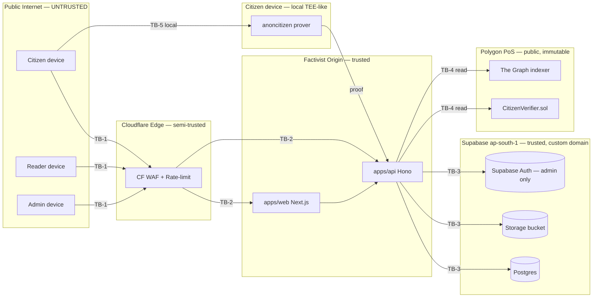

# Factivist S1 — Threat Model (STRIDE)

> **Phase 4 deliverable** (action plan §4.5 — `docs/architecture/threat-model.md`).
> STRIDE pass over the seven S1 containers identified in
> [`s1-c4.md`](./s1-c4.md) LEVEL 2 plus the five trust-boundary crossings
> between them. Companion files:
>
> - [`s1-c4.md`](./s1-c4.md) — container + component diagrams (the model
>   this document threats against).
> - [`aggregates.md`](./aggregates.md) — DDD aggregates (read for who-owns-what
>   when assigning mitigations to a context).
> - [`zkp-key-custody.md`](./zkp-key-custody.md) — companion: every key/secret
>   in S1, custody policy, rotation, incident playbook.
>
> Anonymity is structural, not procedural — see [[ADR-010]]. The S1
> threat model is therefore measured first against **deanonymisation
> vectors**, then against the conventional CIA triad.

---

## Trust boundaries

Five boundary crossings exist in S1. Each is the only legitimate path
between two zones of differing trust.

| # | Boundary | Crossed by | Authentication on the high-trust side |
|---|----------|-----------|---------------------------------------|
| TB-1 | Public internet → Cloudflare edge | Citizens, readers, admins (HTTPS) | Cloudflare WAF + rate-limit; no auth yet. |
| TB-2 | Cloudflare → `apps/web` / `apps/api` (origin) | Edge proxy | Origin shared secret header; mTLS deferred to S2. |
| TB-3 | `apps/api` → Supabase (Postgres + Storage + Auth) | API only (via `packages/db` Drizzle) | Supabase **custom domain** ([[ADR-009]]) + service-role JWT held server-side. Client code never holds it. |
| TB-4 | `apps/api` → Polygon PoS RPC | API only (read) + deploy keys (write, out-of-band) | Read: public RPC. Write: 2-of-3 multisig signer flow ([[ADR-003]], detailed in [[zkp-key-custody.md]]). |
| TB-5 | Citizen device → anoncitizen circuit | Web (WASM worker) / iOS (rapidsnark) / Android (snarkjs) | None required — proof generation is local and ephemeral. The server-fallback path ([[ADR-011]], [[ADR-018]]) crosses TB-1 and TB-3 instead and is treated as an additional exposure surface. |

---

## STRIDE per container

One row per STRIDE category per container. "Owning ADR" is the
authoritative artefact that constrains the mitigation; "Owning context"
is the bounded context that implements it (see [`s1-c4.md`](./s1-c4.md)
LEVEL 3).

### 1. Web App — `apps/web` (Next.js 16, RSC, Cloudflare-fronted)

| STRIDE | Threat | Vector | Mitigation | Owning ADR |
|--------|--------|--------|------------|-----------|
| **S**poofing | Phishing site impersonating Factivist to harvest proofs | Lookalike domain serves a fake onboarding flow that uploads the citizen's Aadhaar photo to attacker. | Brand-pinned origin via Cloudflare; HSTS preload; publish official domain on every authoritative channel; documented in onboarding copy that nothing leaves the device. | [[ADR-009]] |
| **T**ampering | Hostile script injected via dependency (RSC supply chain) | Malicious npm transitive ships a worker that exfiltrates proof inputs. | Locked `bun.lockb`; Renovate weekly; `npm audit --omit=dev` in CI; CSP `script-src 'self'`; subresource integrity on the snarkjs WASM bundle. | [[ADR-002]] |
| **R**epudiation | "I never submitted that complaint" | Citizen disputes authorship after admin removal. | Nullifier+signed session cookie+server timestamp form an evidence triple; immutable `audit_log` row on submit and on moderation. Citizen identity is intentionally non-recoverable (consequence of [[ADR-010]]) — repudiation defence is anchored in the nullifier, not in a name. | [[ADR-010]] |
| **I**nformation Disclosure | Reflected XSS leaks session / nullifier | User-generated body or comment rendered unsafely. | RSC escapes by default; user text passes through Zod-validated `safe-markdown` allowlist; `Content-Security-Policy: default-src 'self'`; no `dangerouslySetInnerHTML` in S1 surfaces. | [[ADR-002]] |
| **D**oS | Page bombarded by botnet, RSC budget exhausted | Vercel function invocations spike. | Cloudflare rate-limit (per-IP + per-ASN); RSC pages are cache-tagged and revalidated on write; Vercel Pro region `bom1` autoscale capped by budget alarm. | [[ADR-009]] |
| **E**oP | Citizen route exposes admin-only data | Mis-segmented route group. | Admin routes live in `(admin)` segment with mandatory `a_auth` middleware ([s1-c4.md L3.7](./s1-c4.md#l37--admin)); route-level integration test asserts 401/403 for anon and citizen JWTs. | [[ADR-010]] |

### 2. Mobile App — `apps/mobile` (Expo SDK, iOS + Android)

| STRIDE | Threat | Vector | Mitigation | Owning ADR |
|--------|--------|--------|------------|-----------|
| **S**poofing | Side-loaded APK with same package name | Attacker distributes modified build that uploads photos to a parallel server. | Play Store + TestFlight as canonical channels; signing-key fingerprint published in onboarding doc; APK ≤ 100 MB constraint preserved so Play Asset Delivery stays viable; in-app code-push (EAS Update) signed bundles only. | [[ADR-008]] |
| **T**ampering | Jailbroken / rooted device tampers with prover bundle | Patched rapidsnark returns attacker-chosen proof. | Server-side `verifyProof` is the source of truth — a tampered local prover cannot fabricate a passing nullifier. Out-of-scope to prevent device tampering; in-scope to make it useless. | [[ADR-011]] |
| **R**epudiation | Citizen claims app submitted complaint without consent | Background sync, UX bug. | All write actions require explicit user gesture; server `audit_log` records the request id + client-version header. | [[ADR-002]] |
| **I**nformation Disclosure | Photo cache leaks EXIF to other apps | Expo `cacheDirectory` shared via "Files" app. | Photos are scrubbed of EXIF **server-side after upload** ([[ADR-004]]); the **on-device** photo retains EXIF until shared/uploaded. Mitigation: client strips EXIF before upload as defence-in-depth, server still strips on receipt; documented in privacy copy. | [[ADR-004]] |
| **D**oS | Forced upload of 100 photos hangs prover | Malicious gallery picker behaviour. | Hard cap of 3 photos per complaint enforced both in `shared` Zod schema and in `apps/api`; tus-resumable upload with timeout. | [[ADR-002]] |
| **E**oP | Deep link bypasses onboarding gate | `factivist://complaint/new` opens composer without nullifier. | Expo Router guard: composer routes call `requireVerified()`; integration test for every deep link asserts redirect to onboarding when unverified. | [[ADR-010]] |

### 3. API — `apps/api` (Hono on Bun, Supabase custom domain)

| STRIDE | Threat | Vector | Mitigation | Owning ADR |
|--------|--------|--------|------------|-----------|
| **S**poofing | Forged session cookie | Attacker replays/forges a citizen session. | Session cookies are HMAC-signed with rotating server key; bound to nullifier + user-agent class; expire on epoch boundary. | [[ADR-010]] |
| **T**ampering | Request body modified in flight | TLS strip on captive Indian Wi-Fi. | HTTPS-only via Cloudflare + Supabase custom domain ([[ADR-009]]); HSTS preload; Zod re-validates on the server for every route ([[ADR-002]]) so a tampered shape is rejected, not interpreted. | [[ADR-002]] |
| **R**epudiation | Operator denies a moderation decision | Admin disputes a removal. | `audit_log` middleware on every admin route ([s1-c4.md L3.3](./s1-c4.md#l33--moderation), [L3.7](./s1-c4.md#l37--admin)) writes append-only row with `actor`, `action`, `target_kind`, `target_id`, `payload_hash`, `ts`. Operator identity is the Supabase Auth JWT subject (operators **are** identified — citizens are not). | [[ADR-006]] |
| **I**nformation Disclosure | SQL injection leaks `citizens.nullifier` set | Unparameterised query. | Drizzle ORM is the only DB access path ([[ADR-001]]); no raw SQL outside reviewed migrations; lint rule blocks `sql.raw` outside `packages/db/src/migrations`. | [[ADR-001]] |
| **D**oS | Single-machine API saturated | `min_machines_running=1` is the cap (cost). | Cloudflare rate-limit per-IP + per-route; Fly.io scale-up to `max_machines=3` on burst; CERT-In log buffer must not block requests (write-through to local file, async ship). | [[ADR-009]] |
| **E**oP | Citizen JWT used on admin route | Misconfigured guard. | Admin middleware `a_auth` checks `role=admin` claim from Supabase Auth and rejects anonymous / citizen sessions; contract test in `apps/api/src/lib/__tests__/rbac.test.ts` asserts 403 for every non-admin principal class. | [[ADR-010]] |

### 4. Postgres — Supabase ap-south-1

| STRIDE | Threat | Vector | Mitigation | Owning ADR |
|--------|--------|--------|------------|-----------|
| **S**poofing | Connection from a non-API client using service-role key | Leaked service key on a developer laptop. | Service-role key lives only on `apps/api` runtime env (Fly.io secrets) — never in `apps/web`, `apps/mobile`, or CI logs; quarterly rotation; pre-commit secret scan via `aidefence_scan`. | [[ADR-001]] |
| **T**ampering | Direct UPDATE bypassing nullifier guard | DBA action or compromised key. | RLS enabled on every citizen-touching table by migration `packages/db/drizzle/0004_enable_rls.sql` (Phase 8 — commit `612fc3228`); `audit_log` is append-only via `INSERT`-only role; daily Drizzle migration diff verified in CI. *(History: pre-0004 the migration set claimed RLS-on in docs but `isRLSEnabled: false` on all 14 tables; gap existed in shipped code for ~24h between Phase 5 close and the Phase 8 §8.6 audit which fixed it. No production exposure — Phase 8 is the operations-handoff phase, no prod deploy occurred.)* | [[ADR-001]] |
| **R**epudiation | DBA mutation untracked | Out-of-band fix. | Supabase audit log enabled at the project level; mirrored hourly into our `audit_log` for retention parity with CERT-In ([[ADR-015]]). | [[ADR-015]] |
| **I**nformation Disclosure | Backup leak deanonymises | Stolen Supabase snapshot. | **There is no PII to leak** — `citizens` table holds only `(nullifier, state_code, district_code, created_at)` ([s1-c4.md L3.1](./s1-c4.md#l31--identity)). Any column added later requires sec-architect review against [[ADR-010]]. Backups encrypted at rest by Supabase; access limited to org owners. | [[ADR-010]] |
| **D**oS | Long-running tsquery exhausts CPU | Adversarial search input. | Search input length-capped in Zod (256 chars); `statement_timeout = 5s` on the read role; FTS limited to indexed columns. | [[ADR-005]] |
| **E**oP | RLS misconfiguration grants anon read on `audit_log` | Migration mistake. | Migration `0004_enable_rls.sql` declares the policy set; `kg-drift-guard.yml` workflow + Drizzle snapshot diff fail CI on any policy regression. RLS coverage test at `packages/db/src/__tests__/rls.test.ts` parses the SQL migration as the source of truth and fails closed if a new citizen-touching table lands without an RLS flip — asserts (a) every Drizzle table is RLS-enabled, (b) citizen-PII tables rely on default-deny (no anon policy), (c) public reference tables expose an anon SELECT, (d) `complaints` anon read is predicated on `status='published'`. | [[ADR-001]] |

### 5. Object Storage — Supabase Storage (`complaint-photos` bucket)

| STRIDE | Threat | Vector | Mitigation | Owning ADR |
|--------|--------|--------|------------|-----------|
| **S**poofing | Attacker uploads to another citizen's complaint | Signed URL re-use. | Signed URLs are scoped to `(complaint_id, photo_index)` and single-use; server records SHA-256 of bytes received and rejects double-upload. | [[ADR-004]] |
| **T**ampering | Photo replaced after moderation approval | Bucket misconfig allows overwrite. | Bucket is private; ACL is `INSERT`-once for the `process-photo` role; subsequent reads via short-lived signed URLs only. | [[ADR-004]] |
| **R**epudiation | "I didn't upload that" | Citizen disputes attached photo. | `photos.sha256` is recorded and immutable; combined with `audit_log` upload row + nullifier session. | [[ADR-004]] |
| **I**nformation Disclosure | EXIF GPS reveals citizen location | Stock camera embeds lat/lon. | Server-side Sharp pipeline strips EXIF + GPS + thumbnail tags **before** flipping `photos.processed_at`; surface is hidden until processed; **see cross-cutting §"PII leakage via photos"** below for the full chain. | [[ADR-004]] |
| **D**oS | Attacker fills bucket with junk | Storage cost runaway. | Per-complaint cap (3 photos × 5 MB); Storage webhook charges against `feature_flags.S1_COMPLAINT_SUBMIT`; nullifier-rate-limit on submit route (5 complaints / 24h / nullifier). | [[ADR-009]] |
| **E**oP | Public bucket read by accident | Bucket policy misconfig. | Bucket is private at creation; integration test polls bucket policy daily and pages on `public=true`; runbook entry in [`zkp-key-custody.md`](./zkp-key-custody.md). | [[ADR-004]] |

### 6. Polygon CitizenVerifier contract

| STRIDE | Threat | Vector | Mitigation | Owning ADR |
|--------|--------|--------|------------|-----------|
| **S**poofing | Fake verifier address used by client | App points to attacker contract. | Contract address pinned at build time, committed to repo, surfaced in `/admin/health`; mismatch = boot abort. | [[ADR-003]] |
| **T**ampering | Malicious upgrade adds backdoor | Single-key deploy compromise. | Verifier deployed under **2-of-3 multisig** with 7-day timelock — see [`zkp-key-custody.md`](./zkp-key-custody.md). | [[ADR-003]] |
| **R**epudiation | "Nullifier wasn't spent" claim | On-chain truth disputed. | Nullifier set is on-chain; `NullifierAdded` events are indexed by The Graph and replayable. | [[ADR-003]] |
| **I**nformation Disclosure | Public nullifier set correlated with off-chain data | Adversary observes verify time + state_code in DB to narrow identity. | Verification time is bucketed (rounded to nearest 5 min) in `citizens.created_at`; `state_code` + `district_code` are the **only** geo facets persisted server-side; no IP, no UA, no time-of-day below 5 min granularity. See cross-cutting §"Citizen deanonymisation". | [[ADR-010]] |
| **D**oS | RPC provider rate-limits us | Free tier saturated. | Primary RPC + 2 fallbacks; The Graph subgraph caches `NullifierAdded`; verify path tolerates 30s RPC latency before failing user-visibly. | [[ADR-003]] |
| **E**oP | Anyone can call `addNullifier` | Missing access control. | `addNullifier` is guarded by `onlyVerifier(proof)`; Hardhat test asserts revert for any path that does not first call `verifyProof`. | [[ADR-003]] |

### 7. The Graph hosted indexer

| STRIDE | Threat | Vector | Mitigation | Owning ADR |
|--------|--------|--------|------------|-----------|
| **S**poofing | Wrong subgraph queried | Typo'd subgraph ID. | Subgraph ID pinned in env + checked at boot. | [[ADR-003]] |
| **T**ampering | Indexer returns falsified events | Hosted-service compromise. | Treated as **untrusted cache**: every nullifier asserted by the subgraph is re-verified against Polygon RPC on the critical path (verify route) before any DB write. The subgraph only powers the UI freshness signal, never authorisation. | [[ADR-003]] |
| **R**epudiation | n/a — read-only consumer | — | — | — |
| **I**nformation Disclosure | Query patterns leak browsing behaviour | The Graph operator logs queries. | We do not query per-citizen; queries are aggregate (recent nullifiers). No nullifier sent in a query that is not already public on-chain. | [[ADR-010]] |
| **D**oS | Hosted service degrades or sunsets | Vendor risk. | Direct RPC fallback path — the system functions (slower) without the indexer. | [[ADR-003]] |
| **E**oP | n/a — read-only consumer | — | — | — |

---

## Cross-cutting threats

These threats span multiple containers and are called out explicitly
because the per-container STRIDE pass alone under-counts them.

### CC-1 · Citizen deanonymisation (join / timing / IP correlation)

**Threat**: An adversary with read access to one or more of (Postgres
backup, Cloudflare logs, RPC provider logs, ISP DPI) attempts to join
on-chain `NullifierAdded` events to off-chain complaints to identify
a citizen.

**Why it's hard for the adversary**:

- `citizens` table holds no PII ([[ADR-010]], [s1-c4.md L3.1](./s1-c4.md#l31--identity)).
- `complaints.author_nullifier_fk` is the nullifier itself — opaque
  (see [`zkp-key-custody.md`](./zkp-key-custody.md) §Nullifier formula).
- All endpoints terminate at a single custom domain ([[ADR-009]]) so
  per-app DNS fingerprinting is useless.

**Residual vectors and mitigations**:

| Vector | Mitigation | Owner |
|--------|-----------|-------|
| Timestamp correlation between on-chain `NullifierAdded` and DB `citizens.created_at` | Bucket DB timestamp to 5-min granularity; document in code. | identity context |
| IP logging at Cloudflare correlated with DB row | Cloudflare logs are 7-day rolling; not joined to DB; CERT-In requires *some* log retention ([[ADR-015]]) but explicitly **not** for the purpose of identifying citizens. | sec-architect |
| Browser fingerprint cookie correlated to nullifier | Session cookie is HMAC-signed but contains no user-agent details beyond a coarse "ua_class" (mobile/desktop). | identity context |
| Operator deanonymisation attempt | Admin shell does not surface IPs, UAs, or device tokens — only nullifier prefix + counts. Enforced at API ([s1-c4.md L3.7](./s1-c4.md#l37--admin)). | admin context |

Refer to [[ADR-010]].

### CC-2 · PII leakage via complaint photos / comment text

**Threat**: A citizen uploads a photo or types text that contains
third-party PII (their own face, another person's face, an Aadhaar
card, a phone number) and the system republishes it.

**Mitigations**:

1. **EXIF/GPS strip server-side** (Sharp pipeline, [s1-c4.md L3.2](./s1-c4.md#l32--complaint), [[ADR-004]]) — geolocation removed before `processed_at` flips.
2. **`aidefence_has_pii` on every write path** — Hono middleware on `c_create`, `cm_create`, `c_processed` runs the body + photo OCR against the AI-defence PII detector; flags route to moderation queue with `reason=pii-leak` (Phase 3 D4 decision; will be ADR-019).
3. **Manual moderation queue** with `pii-leak` as a distinct reason ([s1-c4.md L3.3](./s1-c4.md#l33--moderation)) — operators can shadow-remove without invoking citizen identity.
4. **Citizen UX copy** in the composer explicitly warns "Photos should be of the issue, not of people" ([[ADR-010]]).

Refer to [[ADR-004]], [[ADR-010]].

### CC-3 · India ISP blocks / DPI

**Threat**: Major Indian ISPs (Jio, Airtel, BSNL) intermittently
throttle or DNS-poison `*.supabase.co` endpoints, breaking onboarding
and uploads.

**Mitigation**: All Supabase endpoints (REST, auth, storage, realtime)
are routed through a Supabase **custom domain** (`api.factivist.in`).
No client code references `*.supabase.co`. DNS is operated by us.

Refer to [[ADR-009]].

### CC-4 · CERT-In log retention compliance

**Threat**: India CERT-In directive (Apr 2022) requires intermediaries
to retain certain logs (system, network, application) for 180 days
within Indian jurisdiction. Non-compliance = regulatory action.

**Mitigation**: A scoped subset of operational logs (request id,
timestamp bucketed to minute, route, status code, **no IP, no nullifier
beyond a 4-byte prefix**) is retained in a separate Supabase project in
`ap-south-1` for 180 days. The retention scope is the minimum required;
PII is structurally absent ([[ADR-010]] forecloses it). Full design
under [[ADR-015]] (status: stub, see Phase 1 backlog).

### CC-5 · DPDP Act minimisation

**Threat**: India DPDP Act 2023 §16 requires data minimisation and
purpose limitation. Storing more than is necessary creates
"significant data fiduciary" obligations the project cannot meet at S1
scale.

**Mitigation**: [[ADR-010]] removes the entire category of personal
data from server scope; [[ADR-007]] limits geo data to the published
closed reference dataset; [[ADR-004]] limits stored photo metadata to
SHA-256 + storage path. Full obligation map under [[ADR-016]] (status:
stub).

---

## Residual risks accepted in S1

These risks are **known and accepted** for S1, with an explicit revisit
date. Each appears as a `risk:` issue in the Phase 1 backlog.

| ID | Risk | Why accepted in S1 | Owner | Revisit |
|----|------|--------------------|-------|---------|
| R-1 | Server-side ZKP fallback path ([[ADR-011]], [[ADR-018]]) accepts the citizen's Aadhaar photo over the wire | Low-tier Android cannot prove locally; refusing them would exclude ~30% of users. Inputs are not persisted (see [`zkp-key-custody.md`](./zkp-key-custody.md) §Server-side fallback). | sec-architect | S2 — re-evaluate after on-device prover improvements. |
| R-2 | Cloudflare logs retain IP for 7d | Required for DDoS mitigation; not joined to DB. | sec-architect | S2 — evaluate Cloudflare Zero Log. |
| R-3 | The Graph hosted indexer is a single vendor | Free + sunsetting risk; offset by direct-RPC fallback. | platform | S3 — migrate to self-hosted or decentralised. |
| R-4 | No mTLS between Cloudflare and origin | Operational cost > S1 risk reduction (shared secret header is in place). | sec-architect | S2. |
| R-5 | Manual-mod queue has no SLA below 24h | Single volunteer at S1 scale (~2h/wk per cost-analyst memo). | moderation | S2 — second volunteer or LLM triage. |

---

## What's deliberately NOT in scope for S1

Mirrors the closing list in [`s1-c4.md`](./s1-c4.md):

- **`ComplaintRegistry.sol` and any second contract** — S2 ([[ADR-003]]). Threat model of a registry contract is deferred.
- **IPFS / Arweave pinning of photos** — S2 ([[ADR-004]]). Pinning service deanonymisation vectors are deferred.
- **External search index (Meilisearch / OpenSearch)** — S3 ([[ADR-005]]). Search-index PII leakage is deferred.
- **LLM-based moderation** — S2. Prompt-injection / data-poisoning surface for an LLM moderator is deferred; manual queue only in S1.
- **Public mobile admin surface** — Admin is web-only. No mobile admin threat model.
- **Multi-region active-active DB** — Supabase single region (`ap-south-1`). DR is a restore-from-backup runbook, not failover.
- **Bug-bounty programme** — Targeted private review in S1; public bounty proposed for S2.

---

## References

- [`s1-c4.md`](./s1-c4.md) — C4 diagrams
- [`zkp-key-custody.md`](./zkp-key-custody.md) — key custody companion
- [[ADR-001]] Drizzle-only DB access
- [[ADR-002]] Zod-shared schemas
- [[ADR-003]] CitizenVerifier-only contract
- [[ADR-004]] Supabase Storage + EXIF strip
- [[ADR-006]] Postgres moderation queue
- [[ADR-009]] Supabase custom domain (India ISP mitigation)
- [[ADR-010]] Citizen anonymity floor
- [[ADR-011]] Hybrid ZKP proving
- [[ADR-015]] CERT-In log retention (stub)
- [[ADR-016]] DPDP minimisation (stub)
- [[ADR-018]] Server-side prover fallback consent UI (Phase 3 D2, pending)
- [[ADR-019]] `pii-leak` flag reason (Phase 3 D4, pending)
